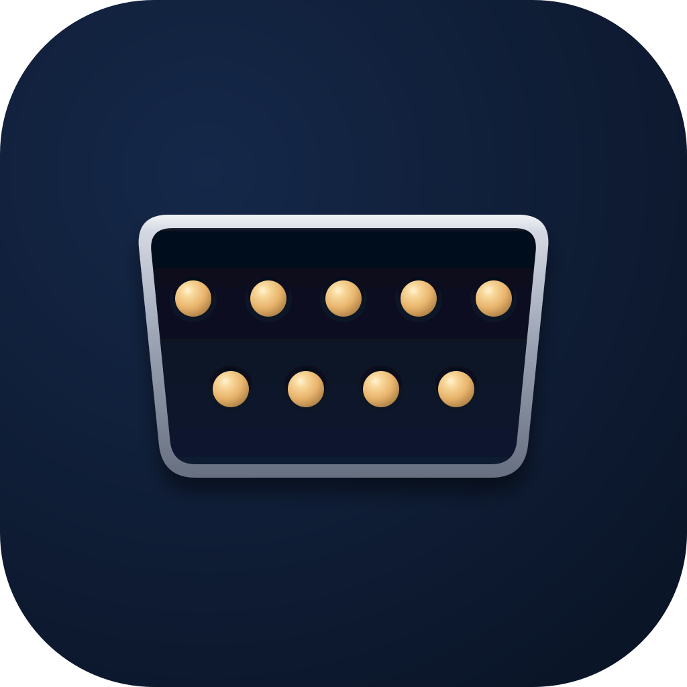
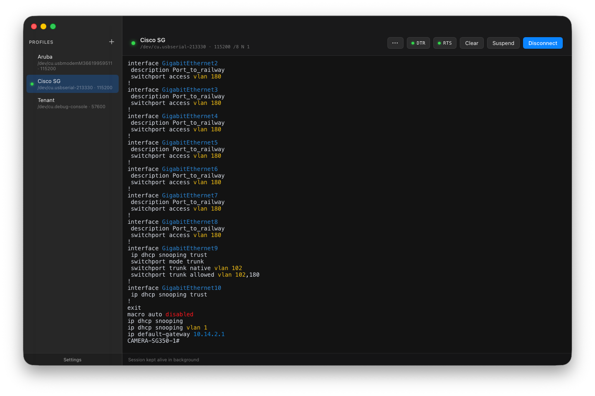

<p align="center">
  
</p>

# Baudrun

[](https://github.com/packetThrower/Baudrun/actions/workflows/ci.yml)
[](https://github.com/packetThrower/Baudrun/releases/latest)
[](https://github.com/packetThrower/Baudrun/releases)
[](src-tauri/Cargo.toml)
[](https://tauri.app)
[](https://svelte.dev)

## Minimum OS Versions

**macOS** (Apple Silicon and Intel)  
[](docs/REQUIREMENTS.md#macos)
[](docs/REQUIREMENTS.md#macos)
[](docs/REQUIREMENTS.md#macos)

**Windows** (x64 and ARM64)  
[](docs/REQUIREMENTS.md#windows)
[](docs/REQUIREMENTS.md#windows)
[](docs/REQUIREMENTS.md#windows)

**Linux** (amd64 and arm64)  
[](docs/REQUIREMENTS.md#linux)
[](docs/REQUIREMENTS.md#linux)
[](docs/REQUIREMENTS.md#linux)
[](docs/REQUIREMENTS.md#linux)
[](docs/REQUIREMENTS.md#linux)
[](docs/REQUIREMENTS.md#linux)

A cross-platform (macOS + Windows + Linux) serial terminal for network devices.

It's built for switch consoles, router CLIs, and other serial-attached network
gear. Baudrun is profile-based: each device gets a named profile storing port,
baud rate, framing, flow control, line ending, and optional send-on-connect
sequences. You connect with one click instead of retyping `screen /dev/cu.usbserial-...`
from memory, hunting for the baud rate a specific switch expects, or opening a
different terminal app for each kind of adapter.

Developed in close collaboration with Claude (Anthropic). See
[AI-USAGE.md](AI-USAGE.md) for how that split works.

<p align="center">
  <picture>
    <source media="(prefers-color-scheme: dark)" srcset="docs/assets/screenshots/macos-dark-baudrun.png">
    <source media="(prefers-color-scheme: light)" srcset="docs/assets/screenshots/macos-light-baudrun.png">
    
  </picture>
</p>

## Features

- **Profile-based connections** — named settings per device (port, baud,
  framing, flow control, line ending, and more), stored as plain JSON.
  See [docs/PROFILES.md](docs/PROFILES.md) for the full schema and
  bulk-provisioning recipes.
- **Auto-detecting ports + chipset identification** — USB VID/PID lookup
  surfaces the chipset family (CP210x, FTDI, PL2303, CH340, MCP2221,
  and a dozen more) and links to the vendor driver when one's missing.
  Works out of the box with CDC-ACM USB-C consoles (HPE/Aruba, newer
  Cisco, RuggedCom RST2228).
- **Rich terminal** — xterm.js backend with 10k-line scrollback, line-
  ending translation, local echo, hex view / send, line timestamps,
  session logging to file, copy-on-select, custom baud rates, and
  Backspace/Delete mapping.
- **Auto-reconnect** — on by default; USB adapter drops recover
  transparently with the xterm buffer preserved across the gap.
  Keeps working while the session is suspended. Disable per profile
  if you'd rather see drops surface immediately.
- **Send Break** — 300 ms TX-low pulse for Cisco ROMMON, Juniper
  diagnostic mode, and boot-loader interrupts.
- **Paste safety** — multi-line confirmation prompt + configurable slow
  paste so UARTs with small buffers don't drop bytes.
- **File transfer** — XMODEM / XMODEM-CRC / XMODEM-1K / YMODEM for
  firmware uploads to embedded bootloaders.
- **Suspend / Resume** — step away from a connected session without
  tearing down the serial port; xterm stays mounted so the full
  backlog is preserved on return.
- **Multi-window** — right-click any profile or drag it out of the
  sidebar to spawn a new window with that profile selected. If the
  profile is the active connection in the source window, the live
  session and visible scrollback follow the tear-off — same port,
  same DTR/RTS state, no mid-session bytes lost. Each window keeps
  its own connection so you can hold parallel sessions to different
  devices side by side.
- **Syntax highlighting for network gear** — bundled rule packs for
  vendor-neutral output plus device-specific sets for Cisco IOS,
  Juniper Junos, Aruba AOS-CX, Arista EOS, and MikroTik RouterOS.
  Toggle packs in Settings, override per profile, edit the user
  pack on disk, or import shared packs as JSON. A
  [browser-based playground](https://packetthrower.github.io/Baudrun/playground.html)
  lets you test regex against your own captures. Device-supplied
  ANSI colors pass through unchanged. Available colors: red, green,
  yellow, blue, magenta, cyan, dim.
- **Signed auto-update** — built-in update check on launch (toggle
  off in Settings). When a new release is out a footer toast points
  at the GitHub release notes; clicking Install on a stable update
  downloads the platform bundle, verifies its minisign signature
  against the embedded public key, and relaunches into the new
  version. Pre-releases stay manual (ship signed updater bundles
  but don't update the auto-update endpoint, so existing stable
  installs aren't auto-jumped onto an alpha).

- **13 built-in terminal themes + `.itermcolors` import** — including
  **Colorblind Safe** (Bang Wong's palette from Nature Methods, 2011 —
  perpendicular to the protan/deutan confusion axis so up/down stays
  legible for the ~6% of men with red-green colorblindness), **CRT
  Phosphor**, **Synthwave**, **Brogrammer**, and all the usual
  Dracula/Solarized/Nord/Gruvbox suspects. [docs/THEMES.md](docs/THEMES.md).
- **14 built-in app skins** with light/dark appearance support:

  | Category | Skins |
  |---|---|
  | Default | **Baudrun** |
  | Modern OS | **macOS 26 (Liquid Glass)**, **Windows 11 (Fluent)**, **GNOME (Adwaita)**, **KDE (Breeze)**, **elementary (Pantheon)**, **Xfce (Greybird)** |
  | Retro OS | **macOS Classic**, **Windows XP (Luna)** |
  | Aesthetic | **CRT (Green Phosphor)**, **Cyberpunk (Synthwave)**, **Blueprint**, **E-Ink (Paper)** |
  | Accessibility | **High Contrast** |

  Skins and themes are independent, so you can mix them freely
  (Liquid Glass skin + Solarized Dark theme, CRT skin + CRT Phosphor
  theme, etc.). Author your own via [docs/SKINS.md](docs/SKINS.md).
- **Accessibility** — xterm screen-reader mode, `prefers-reduced-motion`
  respected, Cmd/Ctrl +/- terminal zoom, ARIA labels on every icon-only
  control. Details in [docs/ACCESSIBILITY.md](docs/ACCESSIBILITY.md).
- **Relocatable config directory** — keep profiles, themes, skins, and
  settings alongside your dotfiles; Settings → Advanced picks the
  target.

Everything above is documented in depth under [docs/](docs/). See
[docs/ADVANCED.md](docs/ADVANCED.md) for the feature reference covering
Send Break, hex send/view, file transfer, auto-reconnect, control-line
policies, session logging, driver detection, and config-directory
relocation.

### Documentation
Full reference docs under [docs/](docs/):

| File | Covers |
|---|---|
| [ADVANCED.md](docs/ADVANCED.md) | Every advanced feature: Send Break, hex send/view, file transfer, auto-reconnect, control-line policies, session logging, driver detection, config-directory relocation, and more. It's a reference, not a how-to. |
| [ACCESSIBILITY.md](docs/ACCESSIBILITY.md) | Screen-reader mode, reduced-motion, terminal zoom shortcuts, ARIA-label coverage, and known caveats. |
| [PROFILES.md](docs/PROFILES.md) | Profile JSON schema + bulk provisioning from CSV inventory via jq/Python. |
| [THEMES.md](docs/THEMES.md) | Theme JSON schema, ANSI-slot reference, `.itermcolors` import ecosystem. |
| [SKINS.md](docs/SKINS.md) | Skin CSS-variable reference, light/dark handling, layout tradeoffs. |
| [examples/](docs/examples/) | Annotated `.jsonc` + importable `.json` reference files for authoring your own skin or theme. |

## Requirements

Released builds target recent mainstream OS releases:

- **macOS 11 Big Sur or later** — separate arm64 (Apple Silicon)
  and amd64 (Intel) builds. Pick the one matching your CPU.
- **Windows 10 21H2+ or 11** — needs the [Microsoft Edge WebView2
  Runtime](https://developer.microsoft.com/en-us/microsoft-edge/webview2/),
  preinstalled on Windows 11 and recent 10 builds. amd64 and arm64
  artifacts shipped.
- **Linux with GTK3 + WebKit2GTK 4.1** — Ubuntu 24.04+, Fedora 40+,
  Debian 13+, or current Arch. amd64 and arm64 artifacts shipped in
  `.deb`, `.rpm`, `.pkg.tar.zst`, and `.AppImage` formats.

See [docs/REQUIREMENTS.md](docs/REQUIREMENTS.md) for the detailed
breakdown, including everything you need to build from source.

### USB-to-serial adapter drivers

Required when using an adapter rather than a device's built-in USB console:

| Chipset | Driver |
|---|---|
| **SiLabs CP210x** (Cisco console cables, many industrial adapters) | [silabs.com VCP](https://www.silabs.com/developers/usb-to-uart-bridge-vcp-drivers) |
| **FTDI** (higher-quality adapters) | Built in on macOS 11+ and Windows 10+ |
| **Prolific PL2303** | [prolific.com.tw](https://www.prolific.com.tw); watch for counterfeit / deprecated-chip caveats |
| **WCH CH340/CH341** (cheap clones, Arduino knockoffs) | [wch-ic.com](https://www.wch-ic.com) |
| **USB-C consoles** (HPE/Aruba, newer Cisco, RuggedCom RST2228) | None — CDC-ACM is built into macOS and Windows |

Baudrun will detect known chipsets and point you at the right download when
a driver is missing.

## Install

The easiest path on macOS and Windows is the package manager — auto-update
on `brew upgrade` / `scoop update`, no Gatekeeper / SmartScreen friction
on first launch, and pre-release channels are available alongside stable.
Linux users grab the right `.deb` / `.rpm` / `.AppImage` / `.pkg.tar.zst`
directly from the [Releases](#releases) section.

### macOS — Homebrew

```sh
brew tap packetThrower/tap
brew install --cask baudrun
# or pre-release channel:
brew install --cask baudrun@alpha
```

The `baudrun` cask installs `/Applications/Baudrun.app` and tracks the
latest stable tag. The `baudrun@alpha` cask installs `/Applications/Baudrun
Alpha.app` side-by-side and tracks the latest pre-release tag (`-alpha.N`,
`-beta.N`, `-rc.N`). Both casks strip the macOS quarantine xattr on
install so the app launches without a right-click → Open dance, since
Baudrun ships ad-hoc signed but not notarized.

The tap also holds [PortFinder](https://github.com/packetThrower/PortFinder).
Repo: [packetThrower/homebrew-tap](https://github.com/packetThrower/homebrew-tap).

### Windows — Scoop

```powershell
# Scoop requires git to add buckets — install it first if you don't
# already have it. Skip this if `git --version` already prints
# something.
scoop install git

scoop bucket add packetThrower https://github.com/packetThrower/scoop-bucket
scoop install baudrun
# or pre-release channel:
scoop install baudrun-prerelease
```

`scoop install baudrun` adds a `Baudrun` Start menu shortcut and a
`Baudrun` shim on `PATH`. The pre-release manifest installs side-by-side
with shim `baudrun-alpha` and Start menu entry `Baudrun Alpha`. Both use
the per-arch NSIS installer so x64 and arm64 hosts get the matching
build automatically.

Repo: [packetThrower/scoop-bucket](https://github.com/packetThrower/scoop-bucket).

### Both channels at once

Stable and pre-release coexist on either platform. Useful when you want
to keep stable as your daily driver and run alpha on the side to verify
upcoming changes against your gear.

## Releases

Tagged pushes with a SemVer tag like `v0.4.0` or `v1.0.0` produce a
GitHub Release with artifacts for five targets. The leading `v` only
lives on the git tag; package filenames and `--version` strings drop
it so dpkg, rpm, and pacman read the version natively.

| Platform | Artifact | Notes |
|---|---|---|
| **macOS** | `Baudrun-macOS-<arch>-<version>.zip` (contains `.app`), `Baudrun_<version>_<arch>.dmg` | Per-arch builds: `arm64` for Apple Silicon (M1/M2/M3+), `amd64` for Intel Macs. Pick the one matching your CPU. Each bundle is a self-contained `.app` with `libusb-1.0.0.dylib` bundled under `Contents/Frameworks` so there's no Homebrew dependency. The .zip is produced via `ditto -c -k --keepParent` to preserve code-signing xattrs. |
| **Windows amd64** | `Baudrun_<version>_x64-setup.exe` (NSIS), `Baudrun_<version>_x64_en-US.msi` (stable releases only), `Baudrun-Windows-amd64-<version>.zip` (portable) | Standard 64-bit x86 Windows 10/11. NSIS is the modern Tauri default; MSI requires WiX with numeric-only pre-release identifiers, so pre-release tags ship NSIS only. |
| **Windows arm64** | `Baudrun_<version>_arm64-setup.exe` (NSIS), `Baudrun_<version>_arm64_en-US.msi` (stable releases only), `Baudrun-Windows-arm64-<version>.zip` (portable) | Native Windows on ARM (Surface Pro X, Copilot+ PCs on Snapdragon X). No Prism emulation; runs at native speed. |
| **Linux amd64** | `Baudrun_<version>_amd64.deb`, `Baudrun-<version>-1.x86_64.rpm`, `baudrun-<version>-1-x86_64.pkg.tar.zst`, `Baudrun_<version>_amd64.AppImage` | Standard 64-bit x86 desktop Linux. Pick the format your distro uses; AppImage works anywhere with FUSE. .deb / .rpm / .AppImage are produced by Tauri's bundler; .pkg.tar.zst is built via fpm since Tauri's bundler doesn't target pacman. |
| **Linux arm64** | `Baudrun_<version>_arm64.deb`, `Baudrun-<version>-1.aarch64.rpm`, `baudrun-<version>-1-aarch64.pkg.tar.zst`, `Baudrun_<version>_aarch64.AppImage` | Raspberry Pi 4 / 5, ARM workstations, Apple Silicon Linux VMs. |

Arch users can install the `.pkg.tar.zst` directly with
`pacman -U`. The [packaging/arch/](packaging/arch/) directory holds
a PKGBUILD for AUR submission as `baudrun-bin`, not yet published.

Download, unpack, and run. On macOS, drag `Baudrun.app` into `/Applications`
or open the `.dmg` and use the standard installer view.

The app is ad-hoc signed on macOS but not notarized, and unsigned on
Windows. First-launch friction:
- **macOS**: right-click → Open to bypass Gatekeeper. If macOS still
  refuses with "damaged" or "unidentified developer," strip the
  quarantine flag: `xattr -cr Baudrun.app`. The .dmg installer
  handles signatures correctly out of the box; the .zip works once
  unpacked with Finder or `ditto -x -k`.
- **Windows**: SmartScreen will warn; click "More info" → "Run anyway".
- **Linux**: `.deb` / `.rpm` / `.pkg.tar.zst` install via the package
  manager and ship a udev rule that grants the console user ACL
  access to `/dev/ttyUSB*` without the dialout-group dance. AppImage
  needs FUSE; `chmod +x Baudrun.AppImage && ./Baudrun.AppImage`.

Apple Developer signing + notarization (and Windows code signing)
are planned; see `TODO.md`.

## Building from source

Prerequisites:

- Rust stable (1.77+) — install via [rustup](https://rustup.rs/)
- Node 20+
- The [Tauri prerequisites](https://tauri.app/start/prerequisites/) for
  your platform (system libraries below). The Tauri CLI itself ships
  via `@tauri-apps/cli` as an npm dev-dependency; no separate install
  needed.

System libraries (linked at compile time):

- **macOS**: `brew install libusb pkg-config`
- **Debian / Ubuntu**: `sudo apt install libgtk-3-dev libwebkit2gtk-4.1-dev libsoup-3.0-dev libayatana-appindicator3-dev librsvg2-dev libusb-1.0-0-dev libudev-dev pkg-config`
- **Fedora**: `sudo dnf install gtk3-devel webkit2gtk4.1-devel libsoup3-devel libayatana-appindicator-gtk3-devel librsvg2-devel libusb1-devel systemd-devel pkgconf-pkg-config`
- **Arch**: `sudo pacman -S gtk3 webkit2gtk-4.1 libsoup3 libayatana-appindicator librsvg libusb pkgconf`
- **Windows**: nothing extra — WebView2 runtime ships with Windows 10 21H2+ and 11.

```bash
git clone git@github.com:packetThrower/Baudrun.git
cd Baudrun
npm install                              # pulls Tauri CLI + frontend deps
npm run tauri dev                        # hot-reload dev (Rust + Vite)
npm run tauri build                      # production bundle for host arch
npm run tauri build -- --bundles deb     # only the .deb (Linux)
```

`tauri build` cross-compiles within the same OS family but not across
desktop OSes — Linux artifacts have to be built on Linux, Windows on
Windows, macOS on macOS. The release matrix in CI runs native builds
on each platform's runner; locally a Linux VM (or CI) is the cleanest
way to produce Linux artifacts from a macOS / Windows host.

CI (`.github/workflows/ci.yml`) runs `cargo check` + `cargo clippy
-- -D warnings` + `cargo test --lib` on `macos-26`, `macos-15-intel`,
`windows-latest`, `windows-11-arm`, `ubuntu-latest`, and
`ubuntu-24.04-arm` on each push to `main`, plus a frontend job
(`npm ci`, `svelte-check`, `npm run build`). Tagged pushes matching
SemVer `v[0-9]+.[0-9]+.[0-9]+` (or `v[0-9]+.[0-9]+.[0-9]+-*` for
pre-releases) trigger `.github/workflows/release.yml`, which uses
[`tauri-action`](https://github.com/tauri-apps/tauri-action) to
produce a GitHub Release with all six platform artifacts attached
(macOS arm64/amd64, Windows x64/arm64, Linux amd64/arm64).

## Architecture

```
Baudrun/
├── src-tauri/                     # Rust backend (Tauri v2)
│   ├── Cargo.toml                 # crate manifest, deps (tauri, serialport,
│   │                              # rusb, plist, chrono, uuid, ...)
│   ├── tauri.conf.json            # window config, bundle metadata, Linux
│   │                              # deb/rpm/appimage settings
│   ├── build.rs                   # tauri-build entrypoint
│   ├── capabilities/default.json  # IPC permission grants (dialog, opener,
│   │                              # log, core:window:allow-start-dragging)
│   ├── icons/                     # generated by `cargo tauri icon` from
│   │                              # build/appicon.png
│   ├── resources/
│   │   ├── builtin_themes.json    # 13 built-in terminal themes (data only)
│   │   └── builtin_skins.json     # 14 built-in app skins (data only)
│   └── src/
│       ├── main.rs                # binary entry; calls baudrun_lib::run()
│       ├── lib.rs                 # tauri::Builder setup, plugin registration,
│       │                          # state init, invoke_handler list
│       ├── state.rs               # AppState (stores + active session handle)
│       ├── events.rs              # event-name constants + payload types
│       ├── appdata.rs             # OS config-directory resolution + override
│       ├── profiles.rs            # JSON-backed profile store + validation
│       ├── settings.rs            # global settings store
│       ├── themes/{mod,parse}.rs  # theme store + .itermcolors plist parser
│       ├── skins.rs               # skin store + CSS-var validation
│       ├── serial/
│       │   ├── session.rs         # Session struct, read pump (own thread),
│       │   │                      # DTR/RTS/break, log writer, transfer redirect
│       │   ├── chipsets.rs        # VID/PID + manufacturer chipset table
│       │   ├── ports.rs           # ListPorts + PortInfo
│       │   ├── direct.rs          # libusb-direct port-name codec
│       │   ├── detect.rs          # suspect-port detection (counterfeit Prolific)
│       │   ├── usb_darwin.rs      # ioreg-based missing-driver detection
│       │   ├── usb_windows.rs     # Get-PnpDevice missing-driver detection
│       │   └── usb_other.rs       # Linux/BSD stub
│       ├── usbserial/             # vendored from packetThrower/usbserial-go
│       │   ├── mod.rs             # Port trait, Driver registry, list()
│       │   └── cp210x.rs          # SiLabs CP210x driver via rusb
│       ├── transfer.rs            # XMODEM / XMODEM-CRC / XMODEM-1K / YMODEM
│       │                          # state machines + ChannelReader helper
│       ├── sanitize.rs            # session-log sanitizer (strips ANSI,
│       │                          # collapses CR-heavy line endings)
│       └── commands/              # #[tauri::command] handlers grouped by domain
│           ├── profiles.rs        # CRUD on the profile store
│           ├── themes.rs          # list/import/delete + dialog file picker
│           ├── skins.rs           # list/import/delete + dialog file picker
│           ├── settings.rs        # get/update + log-dir + config-dir + open_path
│           ├── serial.rs          # connect/disconnect/send + DTR/RTS/break +
│           │                      # auto-reconnect loop
│           ├── transfer.rs        # send_file (XMODEM/YMODEM) + cancel_transfer
│           └── window.rs          # set_traffic_lights_inset (decorum)
├── src/                           # Svelte 5 frontend (was frontend/src/)
│   ├── App.svelte                 # sidebar + main layout, session lifecycle
│   ├── style.css                  # CSS custom-property surface (skin root)
│   ├── lib/
│   │   ├── Sidebar.svelte         # profile list + settings button
│   │   ├── ProfileForm.svelte     # profile editor + connect/suspend flow
│   │   ├── Terminal.svelte        # xterm.js wrapper, stays mounted per-session
│   │   ├── PreviewTerminal.svelte # read-only xterm for theme previews
│   │   ├── Settings.svelte        # skin picker, appearance, default theme,
│   │   │                          # theme preview modal, log dir, toggles
│   │   ├── highlight.ts           # line-buffered ANSI-aware colorizer
│   │   ├── hexdump.ts             # 16-byte-per-line hex+ASCII formatter
│   │   └── api.ts                 # thin @tauri-apps/api invoke + listen wrapper
│   └── stores/                    # Svelte stores (profiles, themes, skins,
│                                  # settings, session, appearance, dismissed-drivers)
├── build/                         # icon source + per-OS metadata
│   ├── appicon.svg                # source of truth — run make-icon.sh after edits
│   ├── appicon.png                # rasterized; fed to `cargo tauri icon` to
│   │                              # regenerate src-tauri/icons/
│   ├── make-icon.sh               # regenerates appicon.png from the SVG
│   │                              # (needs rsvg-convert + ImageMagick 7)
│   ├── darwin/Info.plist          # macOS bundle metadata
│   └── windows/                   # Windows .ico + manifest
├── packaging/                     # downstream packaging metadata
│   ├── linux/baudrun.desktop      # freedesktop entry shipped in .deb/.rpm/AppImage
│   ├── linux/60-baudrun-serial.rules  # udev rule (uaccess for /dev/ttyUSB*)
│   ├── linux/baudrun-postinstall.sh   # reload udev on install/upgrade
│   └── arch/                      # AUR PKGBUILD for baudrun-bin
└── .github/workflows/
    ├── ci.yml                     # cargo check/clippy/test on
    │                              # macOS, Windows (amd64/arm64), Linux (amd64/arm64)
    │                              # + frontend (svelte-check + vite build)
    ├── release.yml                # tag-triggered build via tauri-action;
    │                              # emits .app/.dmg per macOS arch,
    │                              # .msi/.exe (NSIS)/.zip per Windows arch,
    │                              # and .deb/.rpm/.AppImage/.pkg.tar.zst
    │                              # per Linux arch
    └── docs.yml                   # mkdocs build + GitHub Pages deploy
```

**Data flow.** Bytes from the serial port flow as base64-encoded Tauri
events (`serial:data`) to preserve binary fidelity, are decoded in
`api.onData`, fed through either the highlighter (with optional per-line
timestamp prefixing) or the hex-dump formatter depending on per-profile
settings, and written to the xterm instance. If session logging is
enabled, a separate log-file sink (a `SanitizingLogWriter` that strips
ANSI escapes and collapses CR-heavy line endings) receives a copy of
every byte. Keystrokes go the other way via `api.sendBytes`
(`invoke("send", {...})`) with line-ending translation applied on the
frontend.

**Serial lifecycle.** Opening a port spawns a dedicated read-pump thread
with a 100ms read timeout. On the native backend, `serialport::SerialPort::try_clone`
splits the underlying file descriptor so command invocations
(`send`, `set_dtr`, `send_break`, …) don't contend with the blocking
read. On the libusb-direct backend (CP210x), an `Arc<dyn Port>` is shared
between the read thread and command handlers — `rusb` allows concurrent
bulk read + bulk write on the same handle. `Session::close` is idempotent:
it sets a closed flag, applies on-disconnect DTR/RTS policies, and joins
the pump thread before releasing the handle.

**Terminal persistence.** The `<Terminal>` component stays mounted as long
as there's an active session, even when the UI is showing the profile form
or settings. CSS toggles visibility; xterm keeps buffering incoming bytes
into its scrollback. A `refit()` call on resume re-syncs the viewport
dimensions.

**Skin application.** On app mount, the skin applier sets every variable
from the active skin's JSON onto `document.documentElement`, tracking which
properties it has written. Switching skins first unsets all tracked
properties (so sparser skins don't inherit stale values from richer ones)
then applies the new set. Live-swap, no reload. macOS traffic-light
position re-applies via `tauri-plugin-decorum` to land inside the
floating-bubble layout for skins like Liquid Glass.

## License

[GNU General Public License v3.0 or later](LICENSE). Forks are
welcome; derivative works must stay open under the same license.
Commercial use is permitted but can't close the source.
