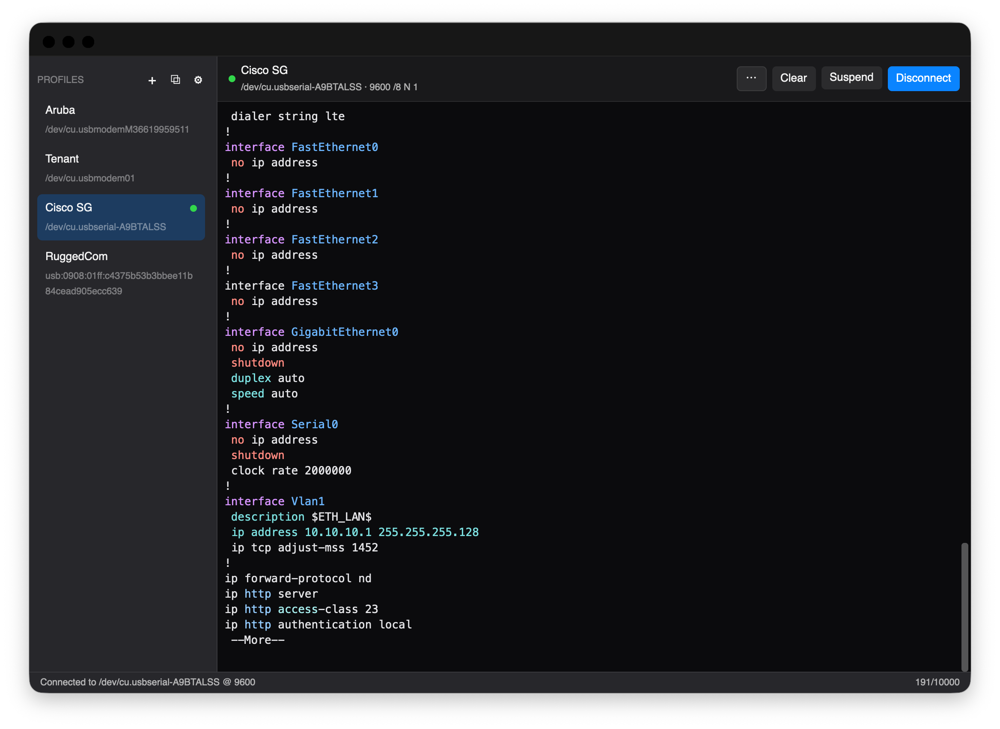

<p align="center">
  
</p>

# Baudrun

[](https://github.com/packetThrower/Baudrun/actions/workflows/ci.yml)
[](https://github.com/packetThrower/Baudrun/releases/latest)
[](https://github.com/packetThrower/Baudrun/releases)
[](Cargo.toml)
[](LICENSE)

## Minimum OS versions

**macOS** (Apple Silicon and Intel)

[](https://packetthrower.github.io/Baudrun/reference/requirements/)
[](https://packetthrower.github.io/Baudrun/reference/requirements/)

**Windows** (x64 and ARM64)

[](https://packetthrower.github.io/Baudrun/reference/requirements/)
[](https://packetthrower.github.io/Baudrun/reference/requirements/)

**Linux** (amd64 and arm64)

[](https://packetthrower.github.io/Baudrun/reference/requirements/)
[](https://packetthrower.github.io/Baudrun/reference/requirements/)
[](https://packetthrower.github.io/Baudrun/reference/requirements/)
[](https://packetthrower.github.io/Baudrun/reference/requirements/)
[](https://packetthrower.github.io/Baudrun/reference/requirements/)

Linux additionally needs a Vulkan-capable GPU with current Mesa drivers.

A cross-platform serial terminal for network devices. Built for switch consoles,
router CLIs, and other serial-attached gear. Each device gets a saved profile
with its port, baud rate, framing, flow control, line ending, and any
send-on-connect sequences. One click connect.

Developed in close collaboration with Claude (Anthropic). See
[AI-USAGE.md](AI-USAGE.md) for how that split works.

<p align="center">
  <picture>
    <source media="(prefers-color-scheme: dark)" srcset="docs-next/public/screenshots/macos-dark-baudrun.png">
    <source media="(prefers-color-scheme: light)" srcset="docs-next/public/screenshots/macos-light-baudrun.png">
    
  </picture>
</p>

## Documentation

Full reference docs live at [packetthrower.github.io/Baudrun](https://packetthrower.github.io/Baudrun/).
The site covers profiles, themes, skins, highlight-rule authoring, the regex
playground, file-transfer protocols, and accessibility. Markdown sources are
under [`docs-next/`](docs-next/).

Sample JSON for authoring your own skins, themes, and highlight packs is on the
[website](https://packetthrower.github.io/Baudrun/authoring/themes/).

## Highlights

- **Profiles.** Each device gets a saved profile — its port, baud, framing,
  flow control, line ending, and control-line policy — stored as plain JSON.
  See [Profiles](https://packetthrower.github.io/Baudrun/usage/profiles/).
- **USB chipset detection.** A VID/PID lookup recognises CP210x, FTDI, PL2303,
  CH340, MCP2221, and others, and links to the vendor driver when one is
  missing. CDC-ACM USB-C consoles (HPE/Aruba, newer Cisco, RuggedCom RST2228)
  work with no driver at all.
- **Auto-reconnect.** When a USB adapter drops, the session comes back on its
  own and the scrollback survives the gap.
- **Output formatting and capture.** Per-line wall-clock timestamps,
  session-local line numbers, a hex-dump view of incoming bytes, and raw
  session recording to a file. Each is a per-profile toggle.
- **Send Break.** A 300 ms TX-low pulse for Cisco ROMMON, Juniper diagnostic
  mode, and bootloader interrupts.
- **File transfer.** XMODEM, XMODEM-CRC, XMODEM-1K, and YMODEM, for pushing
  firmware to embedded bootloaders.
- **Paste safety.** A confirmation prompt before multi-line pastes, plus a
  slow-paste mode so UARTs with small buffers don't drop bytes.
- **Suspend and resume.** Step away from a live session without closing the
  port; the backlog is waiting when you come back.
- **Multi-window.** Right-click a profile to open it in a new window, or drag
  a live session out — the port, scrollback, and DTR/RTS state move with it.
  Run sessions to several devices side by side.
- **Vendor-aware syntax highlighting.** Bundled rule packs for Cisco IOS,
  Juniper Junos, Aruba AOS-CX, Arista EOS, and MikroTik RouterOS, plus a
  vendor-neutral default. Write your own and test them against real captures
  in the [rule playground](https://packetthrower.github.io/Baudrun/playground.html).
- **15 terminal themes, 16 app skins.** Themes include Dracula, Solarized,
  Gruvbox, Nord, OneDark, Tokyo Night, and a Colorblind Safe palette built
  for red-green vision deficiency. Skins include macOS 26 (Liquid Glass),
  Windows 11, GNOME, KDE, CRT, Cyberpunk, Blueprint, E-Ink, High Contrast,
  Foundry, and Tokyo Night. Skins and themes are chosen independently.
- **Accessibility.** Baudrun honours the OS reduce-motion setting, supports
  keyboard zoom, and keeps every action reachable from the keyboard through
  customisable shortcuts. A High Contrast skin and a Colorblind Safe theme
  ship with it. Screen-reader output for the terminal grid is still a gap;
  the [accessibility page](https://packetthrower.github.io/Baudrun/reference/accessibility/)
  has the details.
- **Relocatable config directory.** Keep your profiles, themes, skins, and
  settings next to your dotfiles; set the location in Settings → Advanced.

## Install

On macOS and Windows, the package managers track the latest stable tag and get
you past the first-launch Gatekeeper and SmartScreen warnings. Both also have a
pre-release channel that installs alongside stable.

```sh
# macOS — Homebrew
brew tap packetThrower/tap
brew install --cask baudrun                 # stable
brew install --cask baudrun@alpha           # pre-release

# Windows — Scoop
scoop install git                           # if you don't already have git
scoop bucket add packetThrower https://github.com/packetThrower/scoop-bucket
scoop install baudrun                       # stable
scoop install baudrun-prerelease            # pre-release
```

The taps also hold related tools. Repos:
[packetThrower/homebrew-tap](https://github.com/packetThrower/homebrew-tap),
[packetThrower/scoop-bucket](https://github.com/packetThrower/scoop-bucket).

Linux users grab the matching `.deb` / `.rpm` / `.AppImage` /
`.pkg.tar.zst` directly from the
[Releases page](https://github.com/packetThrower/Baudrun/releases). The packages
install a udev rule for `/dev/ttyUSB*` access, so there's no need to add yourself
to the dialout group. Arch users can install the `.pkg.tar.zst` with `pacman -U`.

To install by hand, download from
[Releases](https://github.com/packetThrower/Baudrun/releases) and drag
`Baudrun.app` to `/Applications` on macOS, or run the NSIS installer on Windows.
The macOS builds are ad-hoc signed, so the first launch needs a right-click →
Open (or `xattr -cr Baudrun.app`); the Windows installer is unsigned, so
SmartScreen needs "More info" → "Run anyway". Notarized macOS builds and signed
Windows builds are both planned — see [TODO.md](TODO.md).

## Building from source

Single-crate Rust project at the repo root.

```bash
git clone git@github.com:packetThrower/Baudrun.git
cd Baudrun
cargo run                                # dev launch (loopback mode if no port)
cargo run -- /dev/cu.usbserial-XXX       # dev launch attached to a port
cargo build --release                    # optimized binary at target/release/Baudrun
```

System libraries:

- **macOS**: `brew install libusb pkg-config`
- **Debian / Ubuntu**: `sudo apt install libusb-1.0-0-dev libudev-dev pkg-config`
- **Fedora**: `sudo dnf install libusb1-devel systemd-devel pkgconf-pkg-config`
- **Arch**: `sudo pacman -S libusb pkgconf`
- **Windows**: nothing extra; the gpui DirectX backend ships with Windows 10+.

## Project layout

```
Baudrun/
├── Cargo.toml                # baudrun crate (binary name: Baudrun)
├── src/
│   ├── main.rs               # app entry + macOS menubar / dock setup
│   ├── app_view.rs           # window-level UI: sidebar, editor, session header
│   ├── terminal_view.rs      # alacritty_terminal bridge + grid renderer
│   ├── terminal_grid.rs      # the cell grid the renderer paints from
│   ├── term_bridge.rs        # alacritty → gpui colour / attribute translation
│   ├── settings_view.rs      # standalone Settings window (tabs, panes, filter)
│   ├── settings_bus.rs       # App-scoped settings entity + change broadcast
│   ├── skin_tokens.rs        # active-skin token cache (read by every render)
│   ├── highlight_runtime.rs  # line-buffered regex highlighter
│   ├── serial_io.rs          # serial-port read/write threads + write channel
│   └── data/                 # pure-Rust data layer (no UI deps)
│       ├── profiles.rs       # JSON-backed profile store + validation
│       ├── settings.rs       # global settings store
│       ├── themes/           # theme store + .itermcolors plist parser
│       ├── skins.rs          # skin store + CSS-var validation
│       ├── highlight.rs      # rule-pack store
│       ├── sanitize.rs       # session-log sanitizer
│       ├── transfer.rs       # XMODEM / YMODEM state machines
│       ├── serial/           # port enumeration + chipset detection
│       ├── usbserial/        # libusb-direct backend (CP210x)
│       └── appdata.rs        # OS config-directory resolution
├── resources/                # bundled at compile time
│   ├── Info.plist            # macOS bundle metadata
│   ├── icons/                # .icns / .ico / .png set
│   ├── builtin_skins.json    # 16 built-in app skins
│   ├── builtin_themes.json   # 15 built-in terminal themes
│   └── highlight/            # bundled vendor rule packs
├── build/                    # icon source + Windows installer assets
├── packaging/                # Linux udev rule + .desktop file + Arch PKGBUILD
├── scripts/                  # dev tools (each its own Cargo workspace)
│   ├── virtual-serial/       # baud-paced virtual pty pair for testing
│   └── transfer-tests/       # headless harness for XMODEM / YMODEM / hex
├── test/                     # tracked fixtures for the test harness
│   ├── transfers/            # deterministic binary + hex payloads
│   └── json/                 # JSON packs for Settings → Import smoke tests
├── docs-next/                # Astro/Starlight docs site source
│   └── public/examples/      # sample skin / theme / highlight-pack JSON
└── .github/workflows/        # CI + release + docs deploy
```

CI (`.github/workflows/ci.yml`) runs `cargo check / clippy / test` across
macOS, Windows, and Linux on every push. Release
(`.github/workflows/release.yml`) builds `.dmg` / NSIS / `.deb` / `.rpm` /
`.AppImage` / `.pkg.tar.zst` bundles via `cargo-packager` on every tag and
attaches them to the GitHub Releases page. The docs workflow (`docs.yml`)
deploys the Astro site to GitHub Pages on changes under `docs-next/`.

## Testing

Two complementary layers.

**Unit tests** (`cargo test`) cover pure-data invariants — JSON
round-trips, parser edge cases, protocol checksum / CRC, the
hex-input validator, the highlight runtime. Fast, no I/O, run on
every CI push.

**Wire-level transfer tests** drive Baudrun's actual XMODEM /
YMODEM / Send-Hex code paths against a baud-paced virtual pty
pair, then byte-diff what arrives at the other end against
deterministic fixtures. See
[`scripts/transfer-tests/`](scripts/transfer-tests/) for the
harness and [`scripts/virtual-serial/TESTING.md`](scripts/virtual-serial/TESTING.md)
for the manual playbook the same fixtures back. Unix-only — pty
primitives don't exist on Windows.

```sh
# one-time setup
(cd scripts/virtual-serial  && cargo build --release)
(cd scripts/transfer-tests  && cargo build --release)

# run all 11 cases (~144 s wall) or pass --quick to skip T9 (~18 s)
./scripts/transfer-tests/target/release/transfer-tests
```

Last verified **2026-05-15** on macOS arm64 (Apple Silicon) against
virtual-serial at the throttled baud rates shown:

| Test | What | Baud | Wall | Result |
|---|---|---:|---:|:---:|
| T1 | hex ASCII (`Hello`) | 9 600 | 0.01 s | ok |
| T3 | hex binary / non-printable (`00 01 02 ff fe 7f`) | 9 600 | 0.01 s | ok |
| T5 | hex 1 KiB random | 9 600 | 1.35 s | ok |
| T11 | YMODEM 512 B over slow link | 9 600 | 5.92 s | ok |
| T6 | YMODEM 4 KiB | 115 200 | 3.69 s | ok |
| T9 | YMODEM 1 MiB | 115 200 | 126.00 s | ok |
| T7c | XMODEM classic (128 B / checksum) | 115 200 | 1.56 s | ok |
| T7C | XMODEM-CRC (128 B / CRC-16) | 115 200 | 1.56 s | ok |
| T7k | XMODEM-1K (1024 B / CRC-16) | 115 200 | 1.55 s | ok |
| T8 | XMODEM single-block (SUB padding) | 115 200 | 1.08 s | ok |
| T10 | YMODEM cancel mid-transfer | 115 200 | 1.18 s | ok |

**11 / 11 passed, 143.9 s wall.** T9 dominates the run time; the
other ten cases together finish in under 18 seconds. Each test
maps to a section in
[TESTING.md](scripts/virtual-serial/TESTING.md) — the harness
exists so the same playbook can be run unattended.

The harness lifts [`src/data/transfer.rs`](src/data/transfer.rs)
verbatim via `#[path]`, so it exercises the same XMODEM / YMODEM
state machines Baudrun ships — protocol-level regressions surface
at the next `cargo build` of the harness without any manual sync
step. See
[scripts/transfer-tests/README.md](scripts/transfer-tests/README.md)
for the full design and flag reference, and
[`test/transfers/`](test/transfers/) for the deterministic payload set.

## License

[GNU General Public License v3.0 or later](LICENSE). Forks are welcome;
derivative works must stay open under the same license. Commercial use is
permitted but can't close the source.
