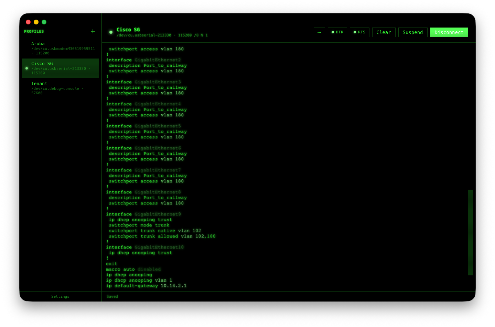
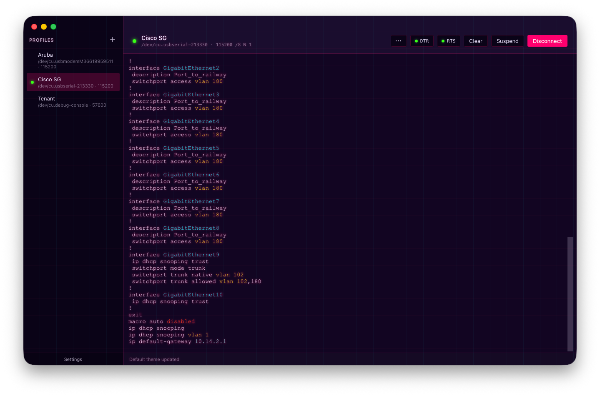

# Screenshots

A walk-through of Baudrun's interface, features, and built-in skins.
Captured on macOS; Windows and Linux render very similarly (window-
chrome decoration aside). All image pairs below swap automatically
when you toggle this site's theme in the top navigation bar.

## Profiles

The profile list and editor — per-device connection settings (port,
baud, framing, flow control, line ending, send-on-connect sequence,
and more) stored as plain JSON. Clicking a profile opens the serial
port and drops you straight into the terminal.

## Settings

The settings pane covers default theme, skin selection, appearance
mode, font size, session-log directory, config-directory relocation,
and global toggles (screen-reader mode, copy-on-select, USB driver
detection).

## Features

### Hex view

Per-profile hex view formats incoming bytes as a 16-byte-per-line
hex + ASCII dump instead of a text stream. Useful for raw protocols
(Modbus RTU, custom binary framing) where you need to see every
byte — including non-printable control characters.

### Line timestamps

Optional per-line timestamp prefix. Handy for correlating device
logs with external events, or for long-running captures where you
want to know when each message arrived.

### Advanced features

The profile editor's Advanced section collects control-line
policies (DTR/RTS on connect/disconnect), auto-reconnect, paste
safety (multi-line confirm + slow paste), session logging, and
backspace key mapping. See [Advanced features](ADVANCED.md) for the
full reference on every flag.

## Built-in skins

Baudrun ships with 14 skins spanning modern OSes, retro OSes,
aesthetic styles, and accessibility. Skins swap the app chrome
(colors, window styling, font choices) independently of the terminal
theme — mix freely. See [Skins](SKINS.md) for the full reference and
the authoring guide for custom skins.

### Baudrun (default)

### macOS 26 (Liquid Glass)

### Windows 11 (Fluent)

### GNOME (Adwaita)

### High Contrast

### CRT (Green Phosphor)

A dark-only skin evoking a classic phosphor terminal — green-on-
black, DotGothic16 type, subtle scanline treatment.

### Cyberpunk (Synthwave)

A dark-only skin with saturated magenta / cyan accents.

