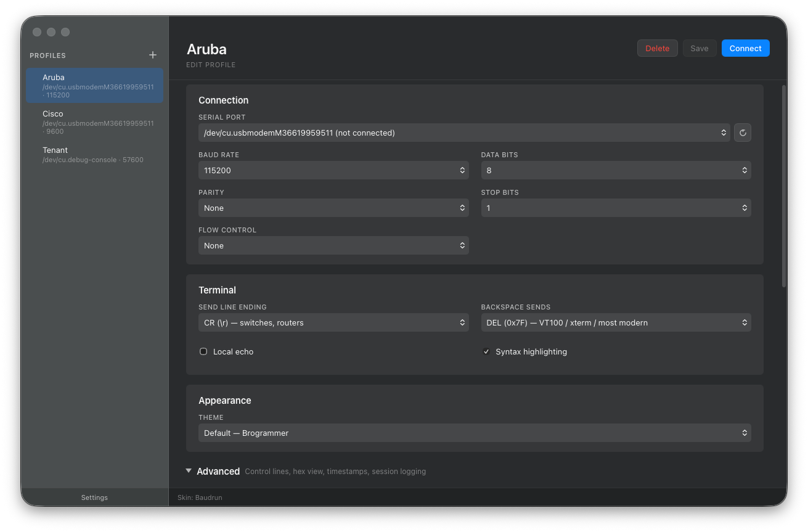
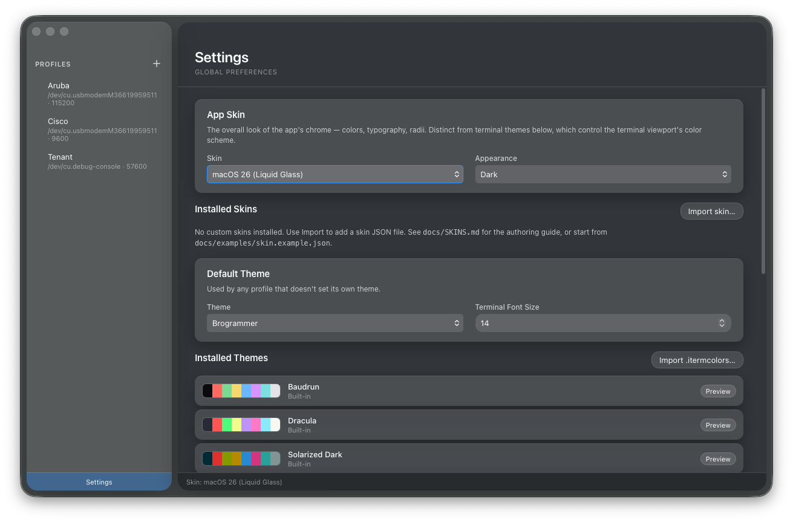
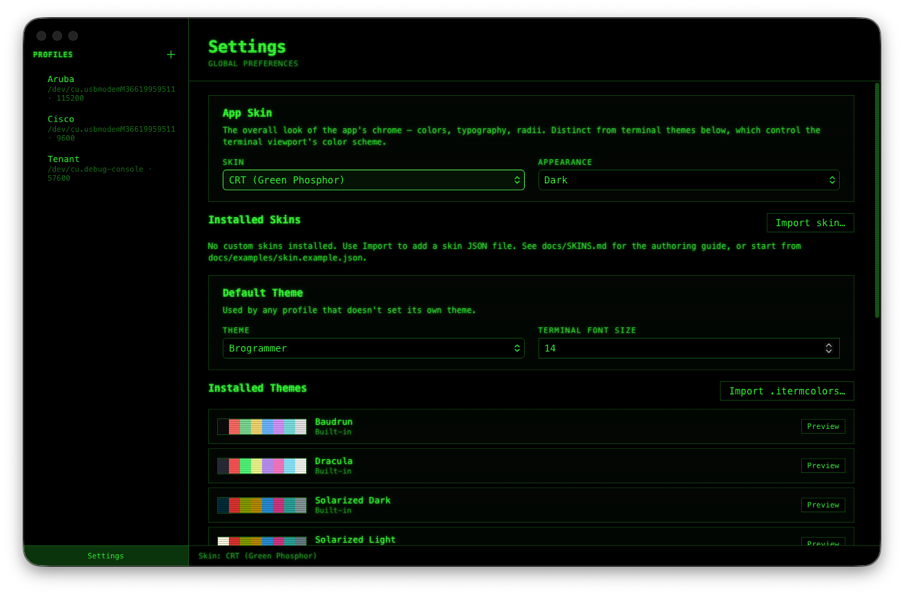

# Screenshots

A walk-through of Baudrun's interface across different views and
skin options. Captured on macOS; Windows and Linux render very
similarly (window-chrome decoration aside).

## Profiles

The profile list and editor — per-device connection settings (port,
baud, framing, flow control, line ending, send-on-connect sequence,
and more) stored as plain JSON. Clicking a profile opens the serial
port and drops you straight into the terminal.

*Dark appearance, default Baudrun skin.*

## Settings — light vs. dark appearance

The settings pane picks up the OS's `prefers-color-scheme` by default
and can also be forced light or dark independently.

The screenshot above swaps automatically when you toggle this site's
theme in the top navigation bar — the app does the same thing in
response to the OS appearance setting.

## Settings — built-in skins

Skins swap the app chrome (colors, window styling, font choices)
independently of the terminal theme. Two alternate skins shown
below; the default Baudrun skin appears in the Light / dark section
above.

**macOS Liquid Glass:**

**CRT (Green Phosphor):**

See [Skins](SKINS.md) for the full reference on all 14 built-in skins
and how to author your own, and [Themes](THEMES.md) for terminal
color schemes that mix freely with any skin.
